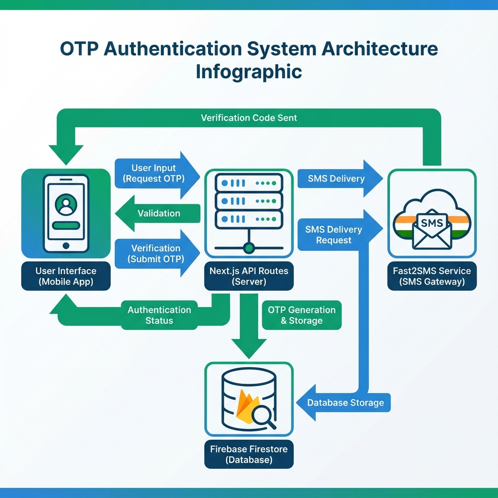

# 🌹 Inpoint Rose Grow - Smart Investment Platform

A production-ready Next.js investment platform with secure OTP authentication for Indian mobile numbers.


## ✨ Features

- 🔐 **Secure OTP Authentication** - Fast2SMS integration for Indian mobile numbers
- 💰 **Investment Management** - Track and manage your investments
- 📊 **Real-time Dashboard** - Monitor your portfolio performance
- 💳 **Deposit & Withdrawal** - Easy fund management
- 💬 **Support Chat** - Direct communication with admin
- 🎁 **Welcome Bonus** - ₹50 bonus for new users
- 📱 **Mobile Responsive** - Works perfectly on all devices

## 🚀 Quick Start

### Prerequisites

- Node.js 18+ installed
- Firebase account (for production)
- Fast2SMS account (for production OTP)

### Installation

```bash
# Clone the repository
git clone <your-repo-url>
cd mobile-app-structures

# Install dependencies
npm install

# Run development server
npm run dev
```

Open [http://localhost:3000](http://localhost:3000) to see the app.

## 🔧 Configuration

### Development (Local)

For local development, OTP will be logged to the console. No external services required.

### Production (Vercel)

Set these environment variables in Vercel dashboard:

**Firebase (Required):**
```
NEXT_PUBLIC_FIREBASE_API_KEY
NEXT_PUBLIC_FIREBASE_AUTH_DOMAIN
NEXT_PUBLIC_FIREBASE_PROJECT_ID
NEXT_PUBLIC_FIREBASE_STORAGE_BUCKET
NEXT_PUBLIC_FIREBASE_MESSAGING_SENDER_ID
NEXT_PUBLIC_FIREBASE_APP_ID
```

**Fast2SMS (Required):**
```
FAST2SMS_API_KEY
FAST2SMS_SENDER_ID=TXTIND
```

**App Config:**
```
NEXT_PUBLIC_APP_NAME=Inpoint Rose Grow
NEXT_PUBLIC_APP_URL=https://your-app.vercel.app
```

See [ENVIRONMENT_SETUP.md](./ENVIRONMENT_SETUP.md) for detailed setup instructions.

## 📖 Documentation

- **[Environment Setup Guide](./ENVIRONMENT_SETUP.md)** - Configure Firebase and Fast2SMS
- **[Deployment Guide](./DEPLOYMENT_GUIDE.md)** - Step-by-step production deployment
- **[OTP Implementation](./OTP_IMPLEMENTATION_SUMMARY.md)** - Technical details of OTP system
- **[Production Ready Summary](./PRODUCTION_READY_SUMMARY.md)** - Complete implementation checklist

## 🔐 OTP Authentication Flow



1. User enters 10-digit Indian mobile number
2. System validates number (must start with 6/7/8/9)
3. 6-digit OTP generated and stored (5-minute expiry)
4. SMS sent via Fast2SMS
5. User enters OTP
6. System verifies (max 3 attempts)
7. User logged in or registered

## 🛠️ Tech Stack

- **Framework:** Next.js 16 (React 19)
- **Styling:** Tailwind CSS
- **UI Components:** Radix UI
- **Database:** Firebase Firestore
- **SMS Service:** Fast2SMS
- **Email Service:** Nodemailer
- **Deployment:** Vercel
- **Analytics:** Vercel Analytics

## 📁 Project Structure

```
mobile-app-structures/
├── app/
│   ├── api/
│   │   ├── auth/          # Authentication APIs
│   │   ├── user/          # User management APIs
│   │   └── support/       # Support chat APIs
│   ├── dashboard/         # User dashboard
│   ├── admin/             # Admin panel
│   ├── login/             # Password login
│   ├── otp-login/         # OTP login
│   └── layout.tsx         # Root layout with metadata
├── lib/
│   ├── otp.ts             # OTP generation & verification
│   ├── otp-validation.ts  # Mobile number validation
│   ├── sms-service.ts     # Fast2SMS integration
│   ├── email-service.ts   # Email OTP service
│   ├── db.ts              # Database operations
│   └── firebase.ts        # Firebase configuration
├── components/
│   └── ui/                # Reusable UI components
├── public/
│   └── images/            # App images and icons
└── docs/                  # Documentation files
```

## 🧪 Testing

### Local Testing
```bash
npm run dev
```
- Navigate to `/otp-login`
- Enter any 10-digit number (starting with 6/7/8/9)
- Check terminal console for OTP
- Enter OTP to login

### Production Testing
- Deploy to Vercel
- Navigate to `/otp-login`
- Enter real mobile number
- Receive SMS with OTP
- Enter OTP to login

## 🔒 Security Features

- ✅ Rate limiting (1 OTP per minute)
- ✅ OTP expiry (5 minutes)
- ✅ Maximum verification attempts (3)
- ✅ Secure password hashing
- ✅ Environment-based configuration
- ✅ No secrets in code
- ✅ Firebase security rules

## 💰 Cost Estimation

### Fast2SMS
- ₹100 = ~400-600 SMS
- Cost per OTP: ₹0.15-0.25
- 1000 users/month: ~₹150-250

### Firebase
- Free tier: 50K reads, 20K writes/day
- Sufficient for small to medium apps

### Vercel
- Hobby: Free (personal projects)
- Pro: $20/month (commercial)

## 🚀 Deployment

### Deploy to Vercel

[](https://vercel.com/new/clone?repository-url=https://github.com/yourusername/your-repo)

Or manually:

1. Push code to GitHub
2. Import to Vercel
3. Add environment variables
4. Deploy

See [DEPLOYMENT_GUIDE.md](./DEPLOYMENT_GUIDE.md) for detailed instructions.

## 📱 Features Overview

### For Users
- 🔐 OTP-based login (no password needed)
- 💰 View wallet balance
- 📊 Track investment history
- 💳 Deposit funds with UTR upload
- 💸 Request withdrawals
- 💬 Chat with support
- 🎁 ₹50 welcome bonus

### For Admins
- 👥 View all users
- ✅ Approve/reject deposits
- 💸 Process withdrawals
- 💬 Support chat management
- 📊 User analytics

## 🤝 Contributing

Contributions are welcome! Please follow these steps:

1. Fork the repository
2. Create a feature branch
3. Commit your changes
4. Push to the branch
5. Open a pull request

## 📄 License

This project is private and proprietary.

## 📞 Support

For issues or questions:
- Check [DEPLOYMENT_GUIDE.md](./DEPLOYMENT_GUIDE.md)
- Check [ENVIRONMENT_SETUP.md](./ENVIRONMENT_SETUP.md)
- Firebase Support: https://firebase.google.com/support
- Fast2SMS Support: https://www.fast2sms.com/support

## 🎯 Roadmap

- [ ] Add more payment gateways
- [ ] Implement investment plans
- [ ] Add referral system
- [ ] Mobile app (React Native)
- [ ] Advanced analytics
- [ ] Multi-language support

## ⚡ Performance

- ✅ Next.js 16 with Turbopack
- ✅ Optimized images
- ✅ Code splitting
- ✅ Server-side rendering
- ✅ Edge functions

## 🌟 Acknowledgments

- Next.js team for the amazing framework
- Vercel for hosting and analytics
- Firebase for database services
- Fast2SMS for SMS delivery
- Radix UI for accessible components

---

**Built with ❤️ for Indian investors**

**Version:** 1.0.0  
**Last Updated:** December 2024  
**Status:** ✅ Production Ready
